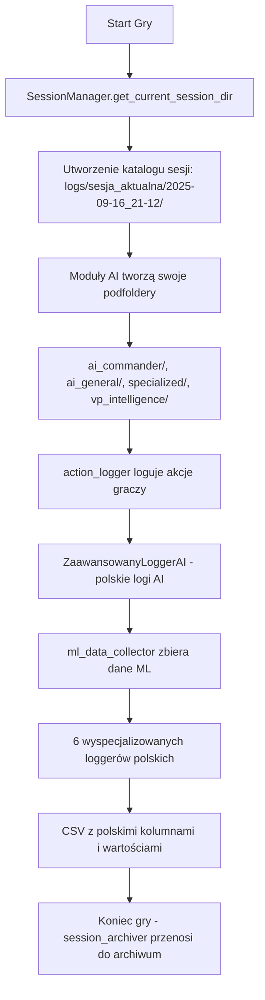

# 🔧 Katalog Utils/ - Narzędzia Systemowe

**Lokalizacja:** `utils/`  
**Typ:** Kluczowe narzędzia systemowe  
**Status:** ✅ Aktywny - wszystkie pliki w użyciu  

---

## 📋 **PRZEGLĄD**

Katalog `utils/` zawiera kluczowe narzędzia systemowe odpowiedzialne za mechanizm logowania, zarządzanie sesjami i wsparcie funkcjonalności gry. Po reorganizacji z września 2025 zawiera **8 aktywnie używanych plików** z rozbudowanym systemem polskich logów AI.

---

## 📁 **STRUKTURA KATALOGU**

```
utils/
├── session_manager.py                      ⭐ KRYTYCZNY - Zarządzanie sesjami logów
├── action_logger.py                        ✅ AKTYWNY - Logowanie akcji graczy  
├── ml_data_collector.py                    ✅ AKTYWNY - Kolekcja danych ML
├── session_archiver.py                     ✅ POMOCNICZY - Archiwizacja sesji
├── game_cleaner.py                         ✅ PRZEKIEROWANIE - Kompatybilność
├── ai_commander_logger_zaawansowany.py     🇵🇱 NOWY - Polski system logów AI
├── ai_logger_config_pl.py                  🇵🇱 KONFIGURACJA - Polskie nazwy i mapowania
└── __pycache__/                           📦 Cache Pythona (auto-generated)
```

---

## 🎯 **SZCZEGÓŁOWY OPIS PLIKÓW**

### ⭐ **session_manager.py** - FUNDAMENT SYSTEMU
**Status:** 🔴 **KRYTYCZNY** - Bez tego pliku system logów nie działa

**Funkcjonalność:**
- Zarządza sesjami gry w katalogu `logs/sesja_aktualna/`
- Tworzy unikalne katalogi z timestampem (np. `2025-09-16_21-12/`)
- Archiwizuje stare sesje do `logs/archiwum_sesji/`
- Singleton pattern - zapobiega duplikatom sesji
- Thread-safe - obsługuje wielowątkowość

**Kluczowe funkcje:**
```python
SessionManager.get_current_session_dir()  # Zwraca katalog bieżącej sesji
SessionManager.end_session()              # Kończy sesję
SessionManager.get_session_info()         # Info o sesji
```

**Używany przez:**
- Wszystkie moduły AI (ai_commander, ai_general, victory_ai)
- VP Intelligence System
- Systemy logowania

---

### ✅ **action_logger.py** - LOGOWANIE AKCJI GRACZY
**Status:** 🟢 **AKTYWNY** - Używany przez interfejs gry

**Funkcjonalność:**
- Loguje akcje graczy do pliku `actions_main.csv`
- Integracja z SessionManager
- Format CSV z separatorem `;`
- Fallback na stary system w przypadku błędów

**Struktura logu:**
```csv
timestamp;turn;player_id;player_nation;player_role;action;token_id;target_token_id;from_q;from_r;to_q;to_r;result;vp_pl;vp_de;pe_pl;pe_de
```

**Używany przez:**
- `gui/panel_mapa.py` - akcje na mapie
- `gui/panel_dowodcy.py` - akcje dowódców
- `gui/panel_generala.py` - akcje generałów

---

### ✅ **ml_data_collector.py** - KOLEKTOR DANYCH ML
**Status:** 🟢 **AKTYWNY** - Używany przez systemy AI

**Funkcjonalność:**
- Zbiera dane strategiczne, taktyczne i gameplay
- Organizuje dane w kategorie: `strategiczne/`, `taktyczne/`, `gameplay/`
- Katalog docelowy: `logs/dane_ml/` (permanentny, nie rotowany)
- Singleton pattern dla wydajności

**Kategorie danych:**
- **Strategiczne:** Decyzje AI generałów, priorytetyzacja
- **Taktyczne:** Ruchy jednostek, walki, manewry
- **Gameplay:** Interakcje graczy, performance, błędy

**Używany przez:**
- `ai/ai_general.py` - decyzje strategiczne
- `ai/ai_commander.py` - dane taktyczne

---

### ✅ **session_archiver.py** - ARCHIWIZACJA SESJI  
**Status:** 🟢 **POMOCNICZY** - Używany przez SessionManager

**Funkcjonalność:**
- Przenosi zakończone sesje z `sesja_aktualna/` do `archiwum_sesji/`
- Rotacja - maksymalnie 5 zarchiwizowanych sesji
- Automatyczne usuwanie najstarszych sesji
- Bezpieczne przenoszenie z obsługą błędów

**Proces archiwizacji:**
1. Przeniesienie katalogów sesji
2. Sprawdzenie limitu (5 sesji)
3. Usunięcie najstarszych archiwów
4. Raportowanie statystyk

**Używany przez:**
- `session_manager.py` - przy inicjalizacji nowej sesji

---

### 🇵🇱 **ai_commander_logger_zaawansowany.py** - POLSKI SYSTEM LOGÓW AI
**Status:** 🔴 **KRYTYCZNY** - Fundament polskiego systemu logowania AI

**Funkcjonalność:**
- 6 wyspecjalizowanych loggerów dla różnych aspektów AI
- Pełne wsparcie polskich nazw kolumn i wartości
- Integracja z SessionManager
- Thread-safe logowanie do CSV
- Automatyczne tłumaczenie enum values

**Logery specjalistyczne:**
```python
StrategicznyLogger    # Decyzje strategiczne AI General
TaktycznyLogger       # Akcje taktyczne jednostek  
EkonomicznyLogger     # Decyzje ekonomiczne
WywiadowczyLogger     # Analiza wywiadu VP
WydajnosciowyLogger   # Metryki wydajności AI
ZwyciezczyLogger      # Analiza warunków zwycięstwa
```

**Używany przez:**
- `ai/ai_commander.py` - główny dowódca AI
- `ai/victory_ai.py` - analiza zwycięstwa
- `ai/ekonomia_ai.py` - decyzje ekonomiczne
- `ai/rozpoznanie_ai.py` - wywiad strategiczny
- Wszystkie testy AI w `tests/`

---

### 🇵🇱 **ai_logger_config_pl.py** - KONFIGURACJA POLSKA
**Status:** 🟢 **KONFIGURACJA** - Centralna konfiguracja polskich logów

**Funkcjonalność:**
- Mapowanie kolumn angielski → polski (50+ kolumn)
- Polskie nazwy plików i kategorii
- Wartości enum po polsku (priorytet, faza, typ_decyzji)
- Centralna konfiguracja dla całego systemu

**Kluczowe mapy:**
```python
POLISH_COLUMN_MAPPING     # Nazwy kolumn: 'timestamp' → 'data_czas'
NAZWY_PLIKOW             # Nazwy plików: 'strategic' → 'decyzje_strategiczne'
POLISH_CONFIG            # Kompletna konfiguracja z enum values
```

**Używany przez:**
- `ai_commander_logger_zaawansowany.py` - główny konsument
- Wszystkie polskie logery specjalistyczne

---

### ✅ **game_cleaner.py** - PRZEKIEROWANIE
**Status:** 🟡 **KOMPATYBILNOŚĆ** - Przekierowuje do głównego cleanera

**Funkcjonalność:**
- Importuje wszystkie funkcje z `czyszczenie/game_cleaner.py`
- Zapewnia kompatybilność wsteczną dla starych importów
- Awaryjne informacje o błędach

```python
# Przekierowanie:
from czyszczenie.game_cleaner import *
```

**Dlaczego istnieje:**
- Historyczne importy w kodzie: `from utils.game_cleaner import ...`
- Unika konieczności refaktoryzacji wszystkich importów
- Bezpieczne przekierowanie z obsługą błędów

---

## 🔄 **PRZEPŁYW SYSTEMU LOGOWANIA**



### **Nowy przepływ polskich logów AI:**
1. `SessionManager` → katalog sesji
2. `ZaawansowanyLoggerAI` → utworzenie 6 loggerów specjalistycznych
3. `ai_logger_config_pl.py` → tłumaczenie nazw i wartości
4. Zapis do CSV z polskimi nagłówkami
5. Archiwizacja sesji z polskimi danymi

---

## ⚙️ **KONFIGURACJA I UŻYCIE**

### **Podstawowe użycie SessionManager:**
```python
from utils.session_manager import SessionManager

# Pobierz katalog bieżącej sesji
session_dir = SessionManager.get_current_session_dir()

# Utwórz podfolder dla swojego modułu
my_logs = session_dir / "moj_modul"
my_logs.mkdir(parents=True, exist_ok=True)
```

### **Logowanie akcji:**
```python
from utils.action_logger import log_action

log_action(
    turn=5,
    player_id=2,
    player_nation="Polska", 
    action="move_unit",
    token_id="P_Kompania_1",
    from_pos=(10, 5),
    to_pos=(11, 5),
    result="success"
)
```

### **Logowanie działań gracza (HumanActionLogger):**
```python
from ai.logs.human_logger import log_human_action

# GameEngine.execute_action wywołuje ten helper automatycznie dla graczy human,
# ale można go także użyć ręcznie w testach/innych narzędziach.
log_human_action(
    player_obiekt,
    turn=5,
    action_type="attack",
    summary="Pancerniacy rozbili artylerię",
    context={
        "token_id": "P_Tank_1",
        "target_token_id": "N_Art_2",
        "damage_dealt": 5,
        "damage_taken": 1,
    }
)
```

### **Logowanie polskich AI:**
```python
from utils.ai_commander_logger_zaawansowany import ZaawansowanyLoggerAI

# Inicjalizacja systemu polskich logów
logger_ai = ZaawansowanyLoggerAI(session_dir)

# Logowanie decyzji strategicznych
logger_ai.strategiczny.log_decyzja_strategiczna(
    tura=5,
    nacja="Polska",
    typ_decyzji="priorytet_ataku",
    kontekst={"enemy_units": 5, "own_units": 8},
    efekt="sukces"
)

# Logowanie wydajności AI
logger_ai.wydajnosciowy.log_wydajnosc_ai(
    cpu_percent=25.5,
    memory_mb=128.3,
    czas_decyzji_ms=45,
    jednostki_analizowane=12
)
```

### **Kolekcja danych ML:**
```python
from utils.ml_data_collector import get_ml_collector

collector = get_ml_collector()
collector.log_strategic_decision(
    player_id="AI_General_Polish",
    decision="attack_priority_change",
    context={"enemy_units": 5, "own_units": 8},
    outcome="successful"
)
```

---

## 🧹 **HISTORIA REORGANIZACJI**

**Data:** 16 września 2025  
**Cel:** Optymalizacja i oczyszczenie katalogu utils/

### **Przed reorganizacją (9 plików):**
- ✅ Zachowano: 5 podstawowych plików
- 🇵🇱 Dodano: 2 pliki polskiego systemu AI
- 📦 Przeniesiono: 3 eksperymentalne do tools/
- ❌ Usunięto: 1 nieużywany plik

### **Aktualna struktura (8 plików):**
- `session_manager.py`, `action_logger.py`, `ml_data_collector.py` - podstawa
- `session_archiver.py`, `game_cleaner.py` - wsparcie
- `ai_commander_logger_zaawansowany.py`, `ai_logger_config_pl.py` - polski system AI

### **Przeniesione pliki:**
- `game_log_manager.py` → `tools/experimental/`
- `ml_data_exporter.py` → `tools/ml/` 
- `smart_log_cleaner.py` → `tools/maintenance/`

### **Usunięte pliki:**
- `ai_log_integrator.py` - nieużywany integrator

---

## 🔧 **KONSERWACJA**

### **Monitorowanie:**
- Sprawdzaj rozmiar katalogu `logs/archiwum_sesji/` (max 5 sesji)
- Monitoruj rozmiar `logs/dane_ml/` (może rosnąć znacząco)
- Sprawdzaj logi błędów w SessionManager

### **Czyszczenie:**
```bash
# Wyczyść cache Python
rm -rf utils/__pycache__/

# Wyczyść stare dane ML (opcjonalnie)
# UWAGA: Dane ML są permanentne - czyść ostrożnie!
```

### **Debugowanie:**
```python
# Sprawdź status sesji
from utils.session_manager import SessionManager
info = SessionManager.get_session_info()
print(info)

# Test ML collectora
from utils.ml_data_collector import get_ml_collector
collector = get_ml_collector()
collector.test_all_logging()  # Test wszystkich funkcji

# Test polskiego systemu AI
from utils.ai_commander_logger_zaawansowany import ZaawansowanyLoggerAI
session_dir = SessionManager.get_current_session_dir()
logger_ai = ZaawansowanyLoggerAI(session_dir)
logger_ai.test_wszystkie_logery()  # Test polskich loggerów
```

---

## 📚 **ZALEŻNOŚCI**

### **Wymagane moduły Python:**
- `pathlib` - manipulacja ścieżkami
- `datetime` - timestamping
- `json` - serializacja danych
- `csv` - format logów
- `threading` - thread safety
- `shutil` - operacje na plikach

### **Wewnętrzne zależności:**
- `session_manager.py` ← używany przez wszystkie inne
- `session_archiver.py` ← używany przez session_manager
- `ai_logger_config_pl.py` ← używany przez ai_commander_logger_zaawansowany
- `ai_commander_logger_zaawansowany.py` ← używany przez moduły AI
- Pozostałe pliki są niezależne

---

## ⚠️ **WAŻNE UWAGI**

1. **Nie usuwaj session_manager.py** - system logów przestanie działać
2. **Nie usuwaj ai_commander_logger_zaawansowany.py** - polskie logi AI przestaną działać
3. **ai_logger_config_pl.py jest współdzielony** - używany przez wszystkie polskie logery
4. **Katalog logs/dane_ml/ nie jest rotowany** - może rosnąć w nieskończoność
5. **Cache __pycache__/ jest automatycznie generowany** - można bezpiecznie usuwać
6. **game_cleaner.py to tylko przekierowanie** - prawdziwy kod jest w czyszczenie/
7. **Maksymalnie 5 sesji w archiwum** - starsze są automatycznie usuwane
8. **Polskie logi używają UTF-8** - sprawdź encoding w edytorach

---

**📝 Ostatnia aktualizacja:** 16 września 2025  
**👨‍💻 Autor:** System automatyczny (reorganizacja)  
**📊 Status:** ✅ Kompletny i aktualny